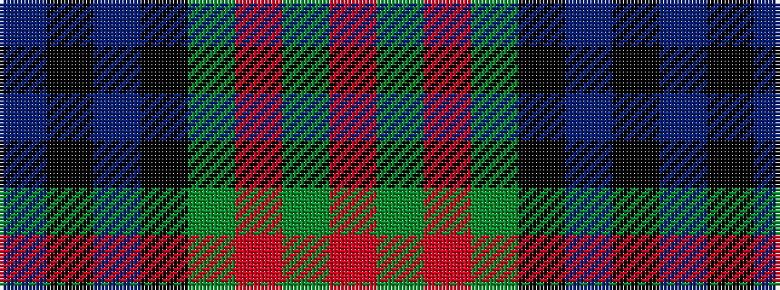

BKBKGRGR

It is a 8 stripe tartan.

<figure class="pat-woven">

<figcaption>idealised sample</figcaption>
</figure>

## Colour Sequence



## Tartans with this colour sequence

| Tartans |
|---------------|
| [Baird](/variants/s8/r7dg3r2dg33k31db31k3db3/)|
||
| [Baird](/variants/s8/r7g3r2g33k31db31k3db3/)|
||
| [Baird (Old) Clan Tartan](/variants/s8/m7g3m2g33k31db31k3db3/)|
||
