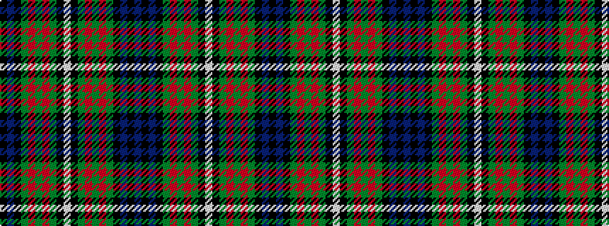

BKBKGRGRGKWKGRGRGKBK

It is a 20 stripe tartan.

<figure class="pat-woven">

<figcaption>idealised sample</figcaption>
</figure>

## Colour Sequence



## Tartans with this colour sequence

| Tartans |
|---------------|
| [Scottish Rugby Union](/variants/s20/db6k2db24k10g2m2g2m2g10k2lb3~x2/)|
||
