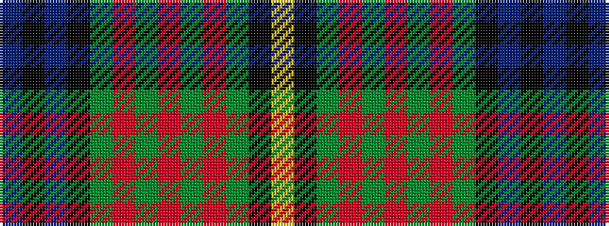

BKBKGRGRGRGKY

It is a 13 stripe tartan.

<figure class="pat-woven">

<figcaption>idealised sample</figcaption>
</figure>

## Colour Sequence



## Tartans with this colour sequence

| Tartans |
|---------------|
| [California](/setts/s13/b4k1db28k16g10r2g10r4g10r2g10k1ly4~x2/)|
||
