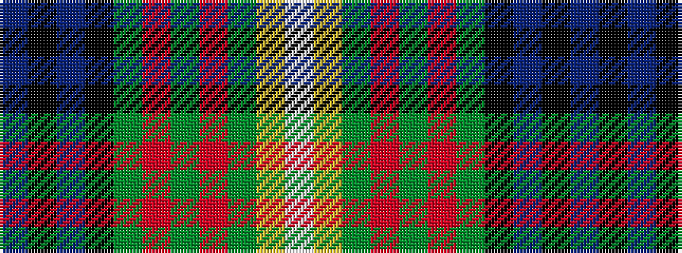

BKBKGRGRGYW

It is a 11 stripe tartan.

<figure class="pat-woven">

<figcaption>idealised sample</figcaption>
</figure>

## Colour Sequence



## Tartans with this colour sequence

| Tartans |
|---------------|
| [Mulcahy](/setts/s11/db66k2db10k15g15r4g15r4g30ly2w4/)|
||
