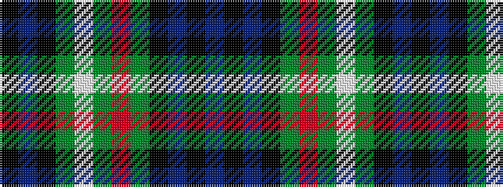

BKBKGRGWGKBK

It is a 12 stripe tartan.

<figure class="pat-woven">

<figcaption>idealised sample</figcaption>
</figure>

## Colour Sequence



## Tartans with this colour sequence

| Tartans |
|---------------|
| [Spar (UK) Ltd](/setts/s12/k2db10k9g9w1g2r1g9k9db10k1db2~x4/)|
||
