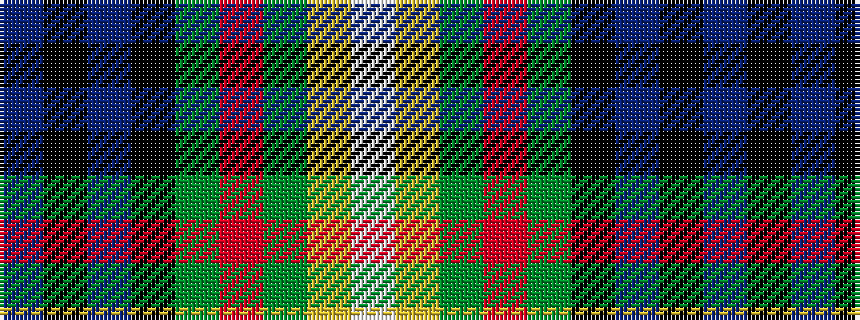

BKBKGRGYW

It is a 9 stripe tartan.

<figure class="pat-woven">

<figcaption>idealised sample</figcaption>
</figure>

## Colour Sequence



## Tartans with this colour sequence

| Tartans |
|---------------|
| [Mulcahy (Name)](/variants/s9/db33k1db5k8g8r2g15ly1w2~x2/)|
||
