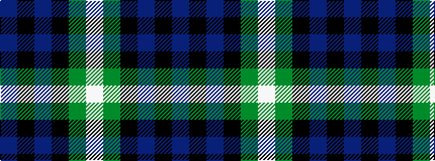

BKBKGW

It is a 6 stripe tartan.

<figure class="pat-woven">

<figcaption>idealised sample</figcaption>
</figure>

## Colour Sequence



## Tartans with this colour sequence

| Tartans |
|---------------|
| [Campbell of Argyll (Smiths)](/variants/s6/db2k2db12k11g16w2~x2/)|
||
| [Campbell, The White Stripe](/variants/s6/db2k2db12k11g12w2~x2/)|
||
| [Granger (Personal)](/variants/s6/db40k4db12k21g27w4~x2/)|
||
