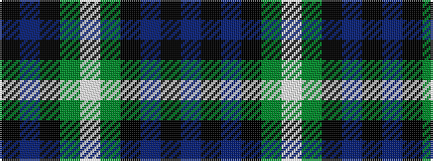

BKBKGWGKBK

It is a 10 stripe tartan.

<figure class="pat-woven">

<figcaption>idealised sample</figcaption>
</figure>

## Colour Sequence



## Tartans with this colour sequence

| Tartans |
|---------------|
| [Argyll Campbell](/setts/s10/k3db17k20dg18w4dg18k20db18k2db2~x2/)|
||
| [Argyll, Campbell](/setts/s10/k3db17k20g18w4g18k20db18k2db2~x2/)|
||
