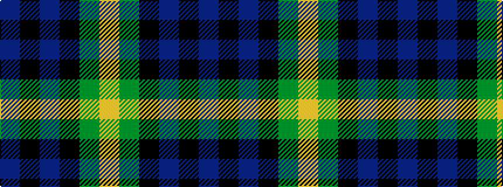

BKBKGY

It is a 6 stripe tartan.

<figure class="pat-woven">

<figcaption>idealised sample</figcaption>
</figure>

## Colour Sequence



## Tartans with this colour sequence

| Tartans |
|---------------|
| [Hudson Valley Reg. Police P & D (Cor](/variants/s6/ly5g16k16db16k2db2~x2/)|
||
