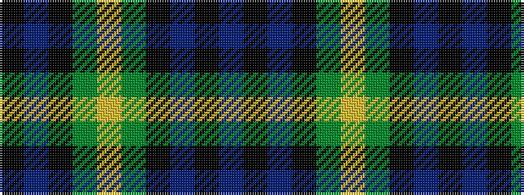

BKBKGYGKBK

It is a 10 stripe tartan.

<figure class="pat-woven">

<figcaption>idealised sample</figcaption>
</figure>

## Colour Sequence



## Tartans with this colour sequence

| Tartans |
|---------------|
| [Gordon Miniature](/setts/s10/db10k2db4k4dg7ly2dg7k4db10k2/)|
||
| [Gordon, Miniature](/setts/s10/db10k2db4k4g7ly2g7k4db10k2/)|
||
