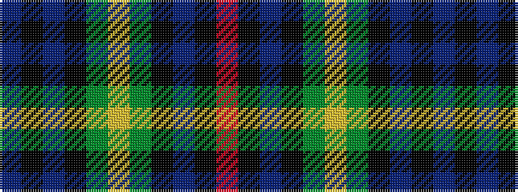

BKBKGYGKBKR

It is a 11 stripe tartan.

<figure class="pat-woven">

<figcaption>idealised sample</figcaption>
</figure>

## Colour Sequence



## Tartans with this colour sequence

| Tartans |
|---------------|
| [Adam Smith (Corporate)](/variants/s11/r2k1dt8k7g8ly2g8k7dt8k1b2~x4/)|
||
| [Scottish Economics Society 'Adam Smith'](/variants/s11/dbi2k1db8k7g8ly2g8k7db8k1r2~x4/)|
||
