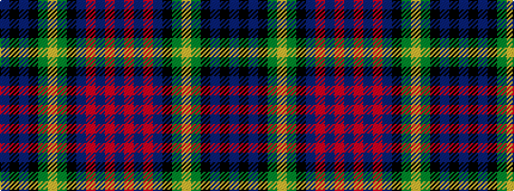

BKBKGYGKBRBRB

It is a 13 stripe tartan.

<figure class="pat-woven">

<figcaption>idealised sample</figcaption>
</figure>

## Colour Sequence



## Tartans with this colour sequence

| Tartans |
|---------------|
| [Keith (District)](/variants/s13/b18r5b3r5b3k20g18ly4g18k20b20k6b6/)|
||
