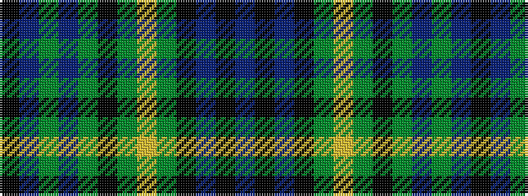

BKBKGYGKGBGBK

It is a 13 stripe tartan.

<figure class="pat-woven">

<figcaption>idealised sample</figcaption>
</figure>

## Colour Sequence



## Tartans with this colour sequence

| Tartans |
|---------------|
| [Gordon Dress (US Fashion)](/setts/s13/k2b1g6b2g2k4g5lo1g5k4db4k2db2~x4/)|
||
