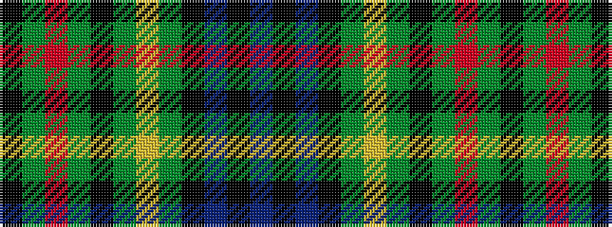

BKBKGYGKGRGK

It is a 12 stripe tartan.

<figure class="pat-woven">

<figcaption>idealised sample</figcaption>
</figure>

## Colour Sequence



## Tartans with this colour sequence

| Tartans |
|---------------|
| [Rollo](/variants/s12/k21g21r4g21k21g21ly4g21k21db21k3db21~x2/)|
||
