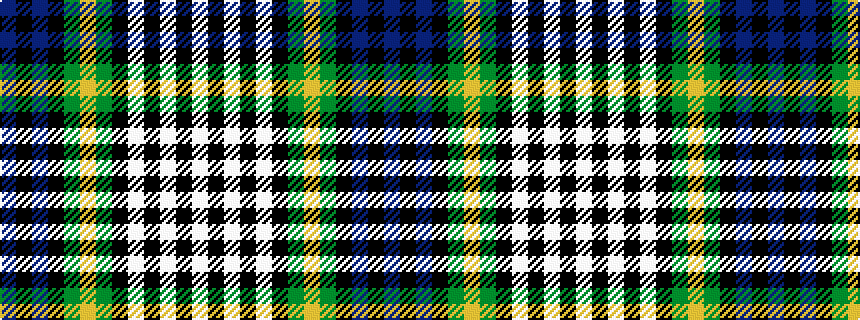

BKBKGYGKWKWKW

It is a 13 stripe tartan.

<figure class="pat-woven">

<figcaption>idealised sample</figcaption>
</figure>

## Colour Sequence



## Tartans with this colour sequence

| Tartans |
|---------------|
| [Gordon Dress #2](/variants/s13/w20k3w3k3w3k16dg17ly5dg17k16db16k3db3~x2/)|
||
| [Gordon, dress 4](/variants/s13/w20k3w3k3w3k16g17ly5g17k16db16k3db3~x2/)|
||
