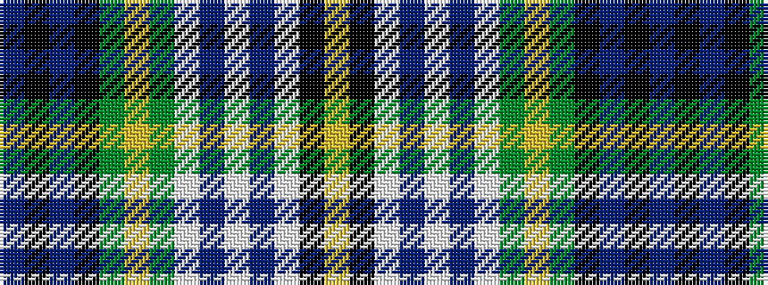

BKBKGYGWBWBWKY

It is a 14 stripe tartan.

<figure class="pat-woven">

<figcaption>idealised sample</figcaption>
</figure>

## Colour Sequence



## Tartans with this colour sequence

| Tartans |
|---------------|
| [Gordon Dress #3](/setts/s14/db2k2db4k4dg4ly1dg4w2db3w14db2w2k2ly1~x4/)|
||
| [Gordon, dress 2](/setts/s14/db2k2db4k4g4ly1g4w2db3w14db2w2k2ly1~x4/)|
||
