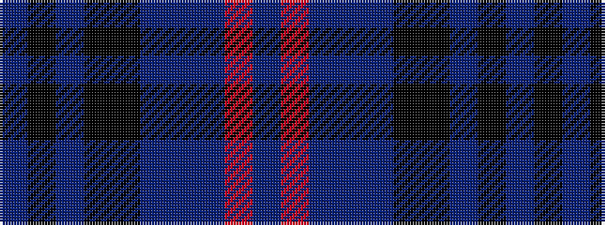

BKBKKBBBRB

It is a 10 stripe tartan.

<figure class="pat-woven">

<figcaption>idealised sample</figcaption>
</figure>

## Colour Sequence



## Tartans with this colour sequence

| Tartans |
|---------------|
| [Scottish Thistle](/setts/s10/dt2k3dt33k11k3dt3dp15dt4o1dt2~x2/)|
||
