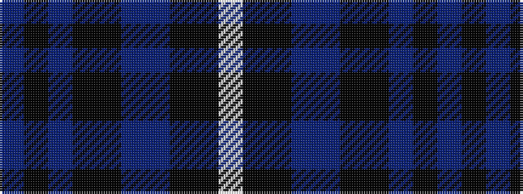

BKBKKBBKKW

It is a 10 stripe tartan.

<figure class="pat-woven">

<figcaption>idealised sample</figcaption>
</figure>

## Colour Sequence



## Tartans with this colour sequence

| Tartans |
|---------------|
| [Melrose Newbigging Grey](/variants/s10/ni1k6n35k6ki2dp3ni1k6ki2w1~x2/)|
||
