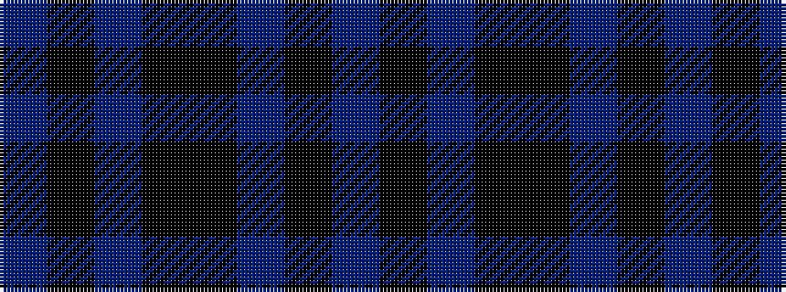

BKBKKBKB

It is a 8 stripe tartan.

<figure class="pat-woven">

<figcaption>idealised sample</figcaption>
</figure>

## Colour Sequence



## Tartans with this colour sequence

| Tartans |
|---------------|
| [Loyalhanna (District?)](/variants/s8/db15ki3db21ki3ki15db2k2db15~x2/)|
||
