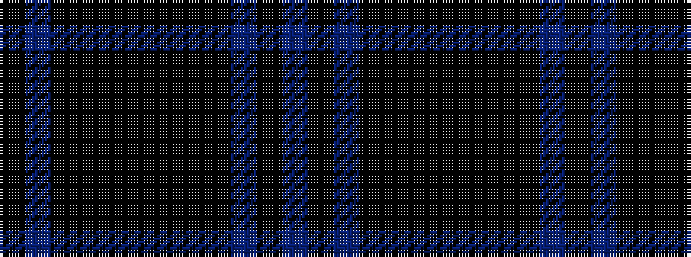

BKBKKKKKKKBK

It is a 12 stripe tartan.

<figure class="pat-woven">

<figcaption>idealised sample</figcaption>
</figure>

## Colour Sequence



## Tartans with this colour sequence

| Tartans |
|---------------|
| [McWilliams Personal Tartan](/variants/s12/k3db15k9ki3k2ki14k2ki3k9db13k2db3~x2/)|
||
