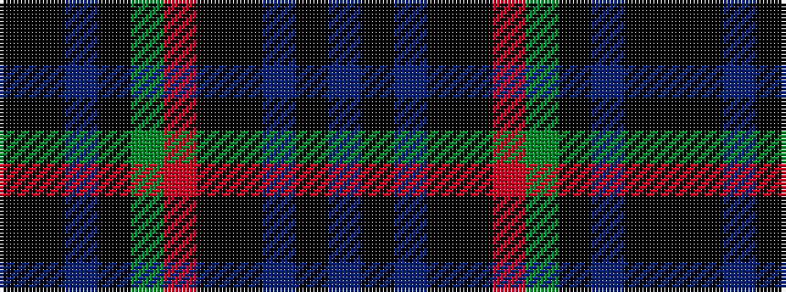

BKBKKRGKBKK

It is a 11 stripe tartan.

<figure class="pat-woven">

<figcaption>idealised sample</figcaption>
</figure>

## Colour Sequence



## Tartans with this colour sequence

| Tartans |
|---------------|
| [Scottish Tartans Authority](/setts/s11/k16k2t2k4dg16r2k15k6t2k3t4~x2/)|
||
