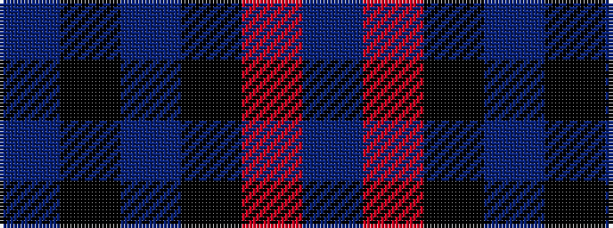

BKBKRB

It is a 6 stripe tartan.

<figure class="pat-woven">

<figcaption>idealised sample</figcaption>
</figure>

## Colour Sequence



## Tartans with this colour sequence

| Tartans |
|---------------|
| [Thompson/Thomson/MacTavish #2](/variants/s6/t2r12k2t6k6t1~x2/)|
||
| [Thompson/Thomson/MacTavish (Bonner)](/variants/s6/db4r30k6db13k13db3~x2/)|
||
| [Thomson, Red (Name)](/variants/s6/t4r28k6t12k12t3~x2/)|
||
