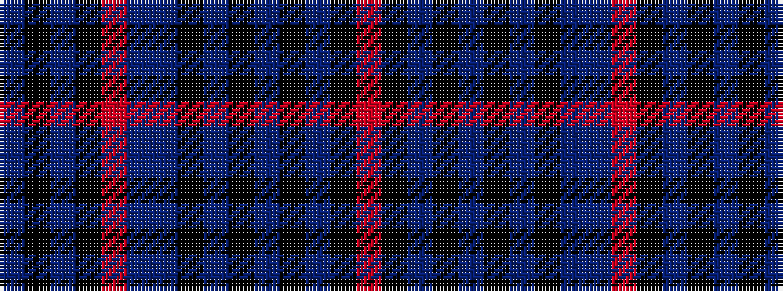

BKBKRBBKBKBKBKR

It is a 15 stripe tartan.

<figure class="pat-woven">

<figcaption>idealised sample</figcaption>
</figure>

## Colour Sequence



## Tartans with this colour sequence

| Tartans |
|---------------|
| [Amble](/setts/s15/do20k6do5k8o4do6t3k1do3k1t3k9t11k1o1~x2/)|
||
| [Amble (Fashion)](/setts/s15/do20k6do5k8o4do6db3k1do3k1db3k9db11k1o1~x2/)|
||
