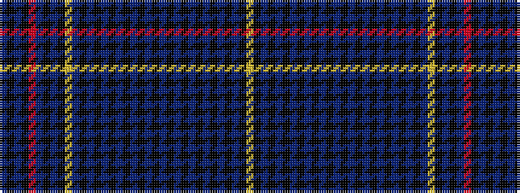

BKBKRBKBKYBKBKBKBKBKBKBKBKBKBKBKBKY

It is a 35 stripe tartan.

<figure class="pat-woven">

<figcaption>idealised sample</figcaption>
</figure>

## Colour Sequence



## Tartans with this colour sequence

| Tartans |
|---------------|
| [Coulin](/variants/s35/lo16k1b1k1b1k1b1k1b1k1b1k1b1k1b1k1b1k1b1k1b1k1b1k1b1lo8k1b1k1b1o9k1b1k1b1~x4/)|
||
