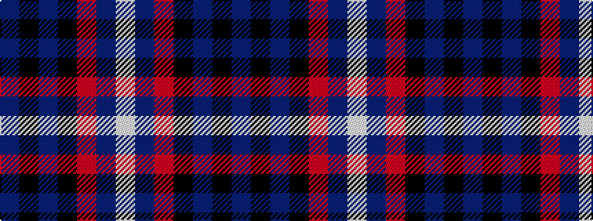

BKBKRBW

It is a 7 stripe tartan.

<figure class="pat-woven">

<figcaption>idealised sample</figcaption>
</figure>

## Colour Sequence



## Tartans with this colour sequence

| Tartans |
|---------------|
| [Thomson, Reona Ellen (Personal)](/variants/s7/w2dp5m34k5n9k12dp1~x2/)|
||
