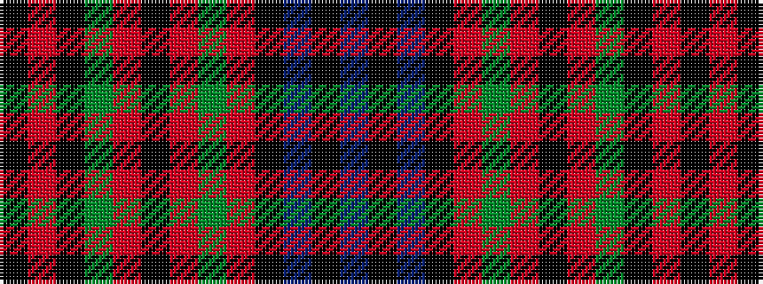

BKBKRGRKRGKRK

It is a 13 stripe tartan.

<figure class="pat-woven">

<figcaption>idealised sample</figcaption>
</figure>

## Colour Sequence



## Tartans with this colour sequence

| Tartans |
|---------------|
| [Alyssa's Theme](/variants/s13/k2o13k8y2o1k1o21y1o1k2b8k13b2~x2/)|
||
