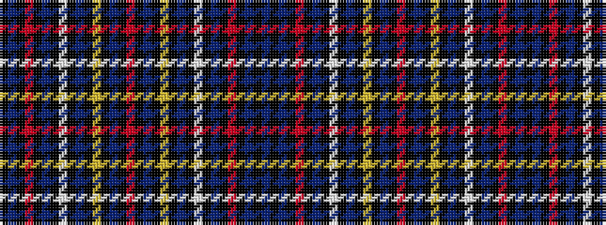

BKBKRKBKWKBKYKBKRKBKYKBKWKBKRKBK

It is a 32 stripe tartan.

<figure class="pat-woven">

<figcaption>idealised sample</figcaption>
</figure>

## Colour Sequence



## Tartans with this colour sequence

| Tartans |
|---------------|
| [Kilburnie](/setts/s32/db12k2db2k2r3k2t6k2w2k2t6k2ly2k2db6k2r2~x2/)|
||
