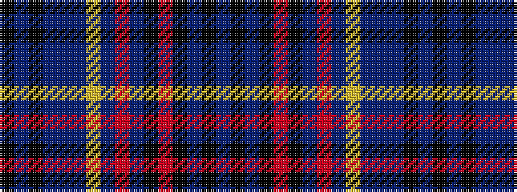

BKBKRKBRBYBBBKBK

It is a 16 stripe tartan.

<figure class="pat-woven">

<figcaption>idealised sample</figcaption>
</figure>

## Colour Sequence



## Tartans with this colour sequence

| Tartans |
|---------------|
| [Pounds](/setts/s16/n21k3n15k4o6k3n2r3n1ly2n1p3n18k2n2k2~x2/)|
||
| [Pounds (Name)](/setts/s16/n21k3n15k4o6k3n2r3n1lo2n1dp3n18k2n2k2~x2/)|
||
