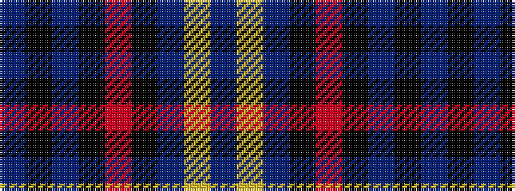

BKBKRKBYB

It is a 9 stripe tartan.

<figure class="pat-woven">

<figcaption>idealised sample</figcaption>
</figure>

## Colour Sequence



## Tartans with this colour sequence

| Tartans |
|---------------|
| [Stone of Destiny](/setts/s9/db4ly2db17k2r4k2db3k11db3~x2/)|
||
