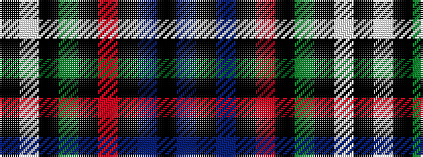

BKBKRKGKWK

It is a 10 stripe tartan.

<figure class="pat-woven">

<figcaption>idealised sample</figcaption>
</figure>

## Colour Sequence



## Tartans with this colour sequence

| Tartans |
|---------------|
| [Thin Blue Line UK](/variants/s10/dt5k35b3k2r3k2g3k2w3k2~x2/)|
||
