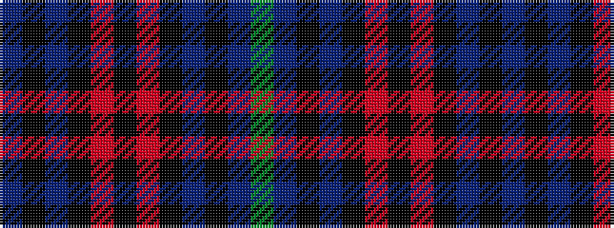

BKBKRKRKBKBG

It is a 12 stripe tartan.

<figure class="pat-woven">

<figcaption>idealised sample</figcaption>
</figure>

## Colour Sequence



## Tartans with this colour sequence

| Tartans |
|---------------|
| [Silver Thistle](/setts/s12/k4o2k46dbi20k6db3g4~x2/)|
||
