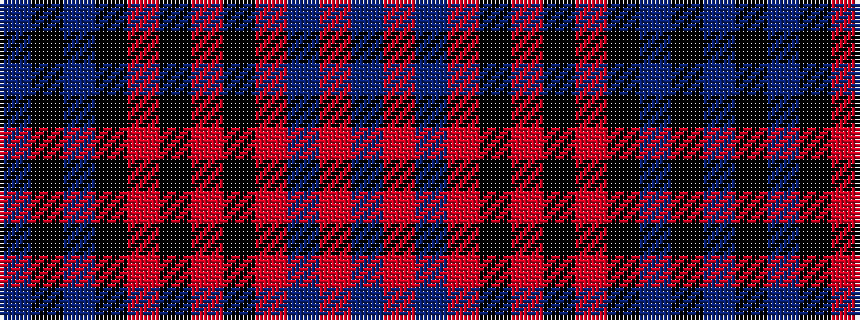

BKBKRKRKRBRB

It is a 12 stripe tartan.

<figure class="pat-woven">

<figcaption>idealised sample</figcaption>
</figure>

## Colour Sequence



## Tartans with this colour sequence

| Tartans |
|---------------|
| [Monarch of Argyll (Fashion)](/setts/s12/n23k6n6k6o38k40o6k40o38n38o6n6/)|
||
