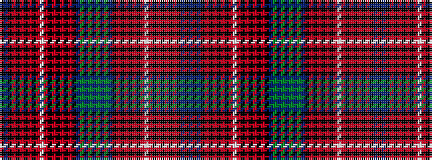

BKBKRKRKRKRWRKRKRKRKBGBGBGBGBKRKRKRKRWRKRKRKRKBK

It is a 48 stripe tartan.

<figure class="pat-woven">

<figcaption>idealised sample</figcaption>
</figure>

## Colour Sequence



## Tartans with this colour sequence

| Tartans |
|---------------|
| [Unidentified #52](/setts/s48/p96g10p8g8p10k34r1k6r4k4r6k2r7w3r7k2r6k4r4k6r1k34b36k6b18~x2/)|
||
