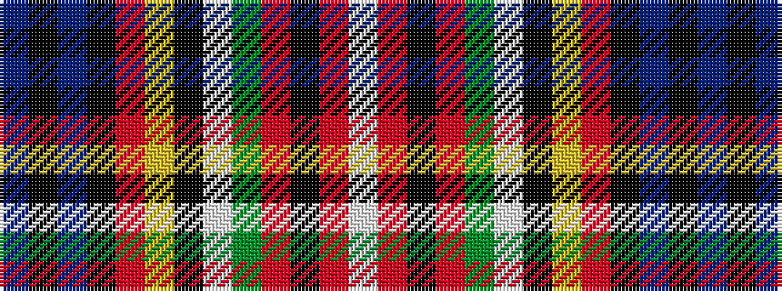

BKBKRYKWGRKRW

It is a 13 stripe tartan.

<figure class="pat-woven">

<figcaption>idealised sample</figcaption>
</figure>

## Colour Sequence



## Tartans with this colour sequence

| Tartans |
|---------------|
| [Dykes, of Perthshire](/setts/s13/t3k3t21k12r12ly3k4w3dg20r8k3r6w3~x2/)|
||
