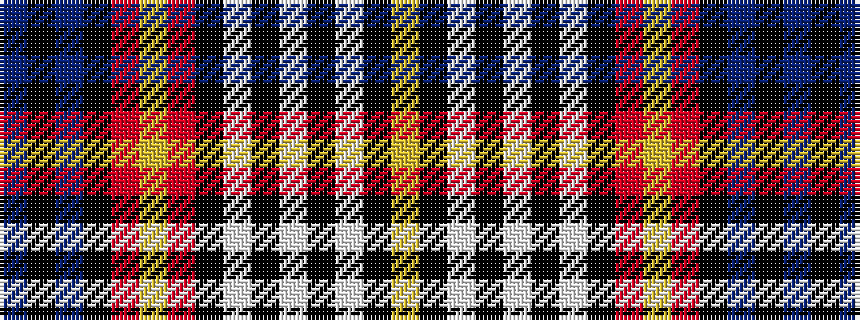

BKBKRYRKWKWKWKY

It is a 15 stripe tartan.

<figure class="pat-woven">

<figcaption>idealised sample</figcaption>
</figure>

## Colour Sequence



## Tartans with this colour sequence

| Tartans |
|---------------|
| [Unidentified #11](/setts/s15/db2k1db6k1r5ly3r5k2w3k2w9k1w2k1ly2~x2/)|
||
