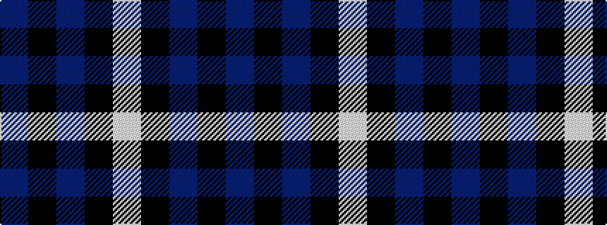

BKBKW

It is a 5 stripe tartan.

<figure class="pat-woven">

<figcaption>idealised sample</figcaption>
</figure>

## Colour Sequence



## Tartans with this colour sequence

| Tartans |
|---------------|
| [Highland Spirit (Fashion)](/variants/s5/dp15k5dp15k21w2~x2/)|
||
| [MacNeil - 1994 (Personal)](/variants/s5/b30k12dt12k2w3~x2/)|
||
