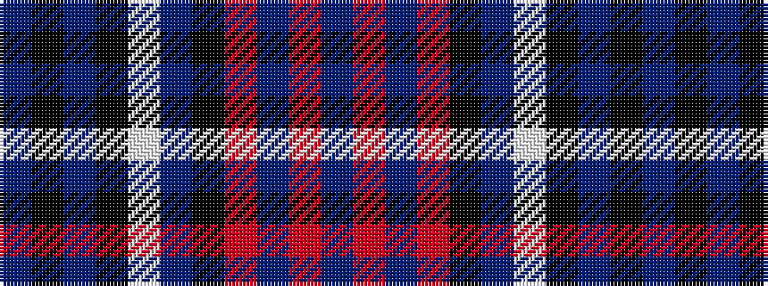

BKBKWBKRBRB

It is a 11 stripe tartan.

<figure class="pat-woven">

<figcaption>idealised sample</figcaption>
</figure>

## Colour Sequence



## Tartans with this colour sequence

| Tartans |
|---------------|
| [Ibrox](/setts/s11/db4r2db2r4k7db10w2k13db18k2db2~x4/)|
||
