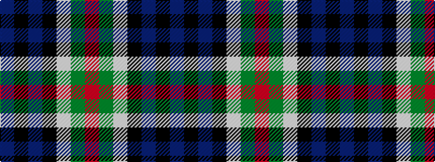

BKBKWGR

It is a 7 stripe tartan.

<figure class="pat-woven">

<figcaption>idealised sample</figcaption>
</figure>

## Colour Sequence



## Tartans with this colour sequence

This pattern is a design lineage: every tartan below shares one colour order, whatever its owner —
near-identical designs are grouped, the largest lineage first (#112: the pattern is a tartan's
second parent, beside its family or clan).

<table class="sett-table">
<tbody>
<tr><td><a href="/setts/r2g8w1k8db8k1db1/">Colquhoun</a></td></tr>
<tr><td class="sett-swatch"></td></tr>
<tr><td><a href="/variants/s7/r2g8w1k8t8k1t1~x6/">Colquhoun #2</a></td></tr>
<tr><td class="sett-swatch"></td></tr>
<tr><td><a href="/variants/s7/db5k10db48k72w12dg48r5/">Colquhoun (Clan)</a></td></tr>
<tr><td class="sett-swatch"></td></tr>
<tr><td><a href="/variants/s7/r3g16w2k16db16k2db2~x2/">Colquhoun Clan Tartan</a></td></tr>
<tr><td class="sett-swatch"></td></tr>
<tr><td><a href="/variants/s7/r5dg19w3k19db19k3db2~x2/">Fruin Colquhoun (Commemorative?)</a></td></tr>
<tr><td class="sett-swatch"></td></tr>
<tr class="cluster-sep"><td></td></tr>
<tr><td><a href="/variants/s7/dp6k3dp21k23w3g24r3~x2/">Colquhoun #3</a></td></tr>
<tr><td class="sett-swatch"></td></tr>
</tbody>
</table>

