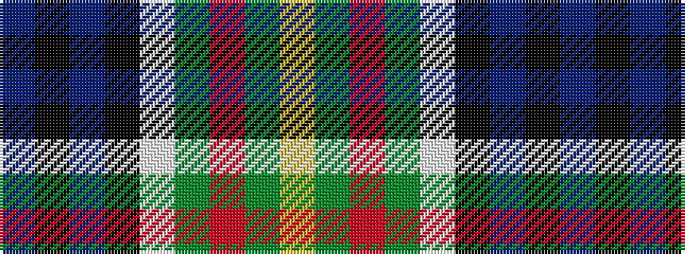

BKBKWGRGY

It is a 9 stripe tartan.

<figure class="pat-woven">

<figcaption>idealised sample</figcaption>
</figure>

## Colour Sequence



## Tartans with this colour sequence

| Tartans |
|---------------|
| [Cusack](/setts/s9/db4k2db16k12w1g13r2g2lo4~x2/)|
||
