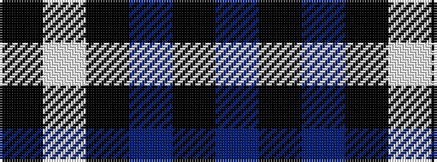

BKBKWK

It is a 6 stripe tartan.

<figure class="pat-woven">

<figcaption>idealised sample</figcaption>
</figure>

## Colour Sequence



## Tartans with this colour sequence

| Tartans |
|---------------|
| [Ramsay](/setts/s6/k4w2k28db30k1db3~x2/)|
||
| [Ramsay Blue Hunting](/setts/s6/k4lb2k28b30k1b3~x2/)|
||
| [Swan](/setts/s6/k3lb2k18db18k2db3~x4/)|
||
