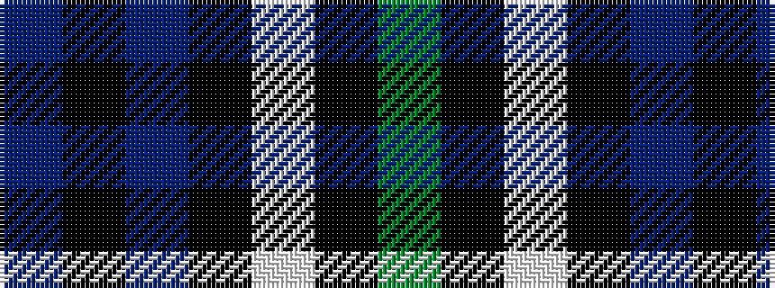

BKBKWKG

It is a 7 stripe tartan.

<figure class="pat-woven">

<figcaption>idealised sample</figcaption>
</figure>

## Colour Sequence



## Tartans with this colour sequence

| Tartans |
|---------------|
| [Kyle](/variants/s7/y19k2w2k2n5k2n5~x4/)|
||
