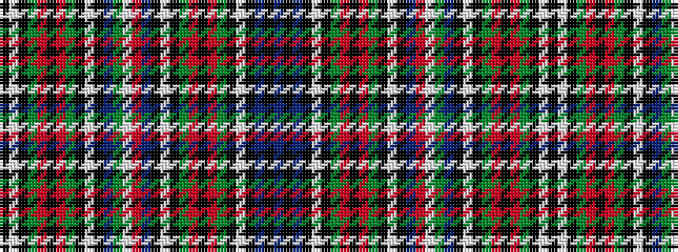

BKBKWKGRKRGKWKBRWGBKWKGRKRGKWK

It is a 30 stripe tartan.

<figure class="pat-woven">

<figcaption>idealised sample</figcaption>
</figure>

## Colour Sequence



## Tartans with this colour sequence

| Tartans |
|---------------|
| [Italian](/setts/s30/db24k2db24k1lb1k1g12r2k2r2g12k1lb1k1db24r2lb2g2db24k1lb1k1g12r2k2r2g12k1lb1k1~x2/)|
||
