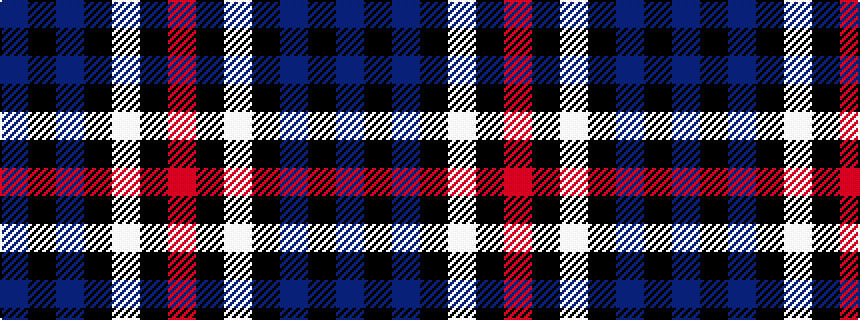

BKBKWKR

It is a 7 stripe tartan.

<figure class="pat-woven">

<figcaption>idealised sample</figcaption>
</figure>

## Colour Sequence



## Tartans with this colour sequence

| Tartans |
|---------------|
| [Kyle Tartan](/variants/s7/o19k2w4k2n5k2n5~x2/)|
||
| [St. Georges, Edgbaston](/variants/s7/r4k21w2k20db21k2db2~x2/)|
||
