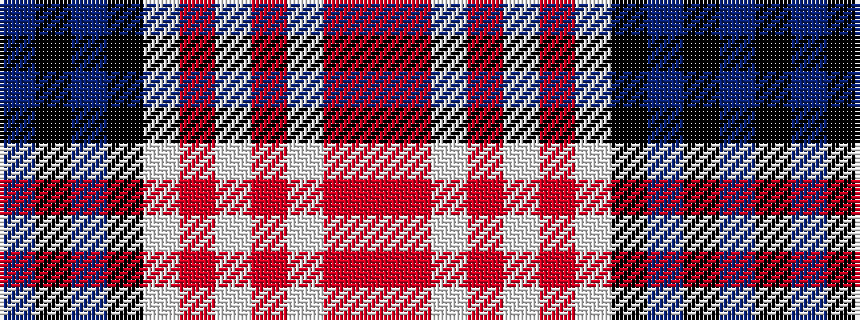

BKBKWRWRWRR

It is a 11 stripe tartan.

<figure class="pat-woven">

<figcaption>idealised sample</figcaption>
</figure>

## Colour Sequence



## Tartans with this colour sequence

| Tartans |
|---------------|
| [Unidentified (2103)](/setts/s11/n2k2n2k2w1o1w1o1w1o1r2~x8/)|
||
