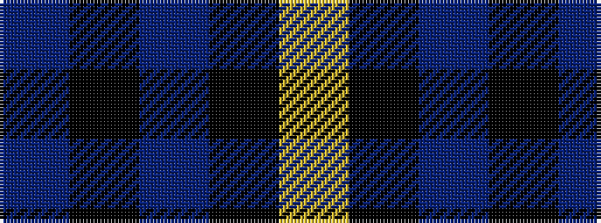

BKBKY

It is a 5 stripe tartan.

<figure class="pat-woven">

<figcaption>idealised sample</figcaption>
</figure>

## Colour Sequence



## Tartans with this colour sequence

| Tartans |
|---------------|
| [Moorlands (Corporate)](/variants/s5/dp27k10dp27k35ly6/)|
||
