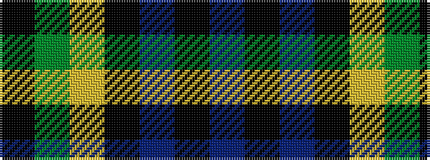

BKBKYGK

It is a 7 stripe tartan.

<figure class="pat-woven">

<figcaption>idealised sample</figcaption>
</figure>

## Colour Sequence



## Tartans with this colour sequence

| Tartans |
|---------------|
| [Mowat](/setts/s7/db26k1db2k18ly2g16k16~x2/)|
||
| [Mowat](/setts/s7/db18k1db2k18ly2dg16k16/)|
||
| [Mowat](/setts/s7/db18k1db2k18ly2dg16k16~x2/)|
||
