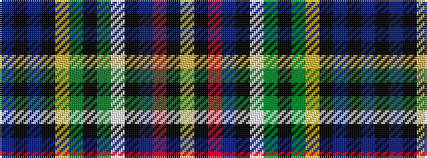

BKBKYGKGWKBRKY

It is a 14 stripe tartan.

<figure class="pat-woven">

<figcaption>idealised sample</figcaption>
</figure>

## Colour Sequence



## Tartans with this colour sequence

| Tartans |
|---------------|
| [Allison (MacGregor-Hastie)](/variants/s14/dbi2k2dbi16k15ly2g16k2g16w2k17db4r6k3ly2~x2/)|
||
| [Allison Family Tartan](/variants/s14/db3k3db15k15ly3dg15k3dg15w3k15dbi4r6k3ly2~x2/)|
||
