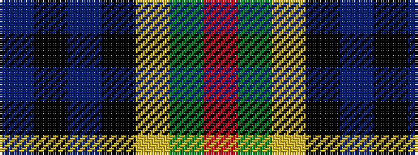

BKBKYGR

It is a 7 stripe tartan.

<figure class="pat-woven">

<figcaption>idealised sample</figcaption>
</figure>

## Colour Sequence



## Tartans with this colour sequence

| Tartans |
|---------------|
| [Colquhoun](/variants/s7/r2dg8lr1k8db8k1db1~x2/)|
||
