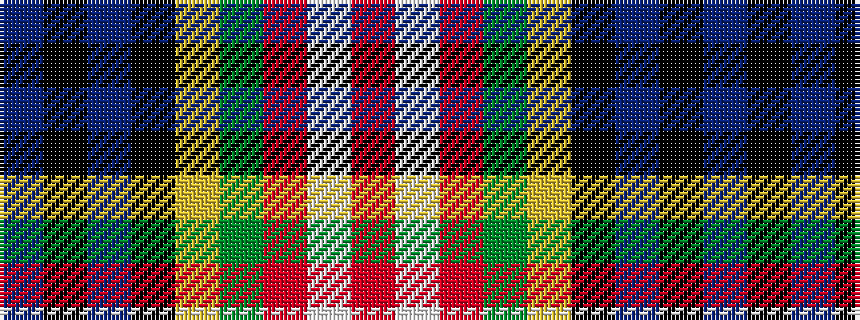

BKBKYGRWR

It is a 9 stripe tartan.

<figure class="pat-woven">

<figcaption>idealised sample</figcaption>
</figure>

## Colour Sequence



## Tartans with this colour sequence

| Tartans |
|---------------|
| [Comyn, Cumming](/variants/s9/r4w1r4g10ly1k10t4k2t4~x4/)|
||
| [Comyn/Cumming](/variants/s9/r4w1r4dg10ly1k10t4k2t4~x4/)|
||
