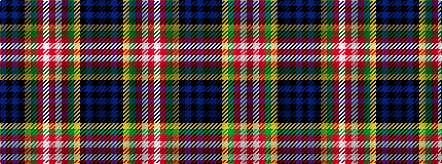

BKBKYGRWRWRGYKBKB

It is a 17 stripe tartan.

<figure class="pat-woven">

<figcaption>idealised sample</figcaption>
</figure>

## Colour Sequence



## Tartans with this colour sequence

| Tartans |
|---------------|
| [Cumming](/variants/s17/t8k4t8k20lo1g20r8w1r8w1r8g20lo1k20t8k4t4~x2/)|
||
